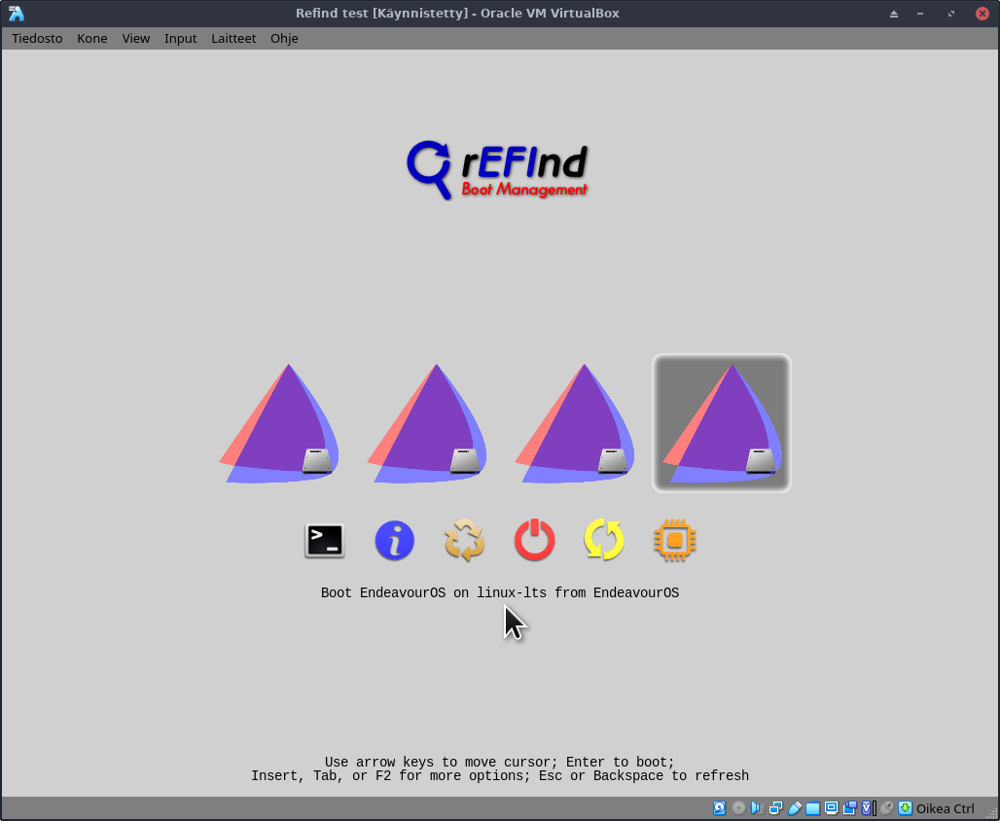

# A rEFInd use case

This is a simple use case of rEFInd was performed in EndeavourOS.<br>
As a result you have 4 main menu entries (picture below):

1. the default entry (see /boot/refind_linux.conf below)
2. a grub fallback entry (useful when testing)
3. boots using the `linux` kernel
4. boots using the `linux-lts` kernel



## Preparations

Be sure to boot in UEFI mode!<br>
You can check UEFI mode with command
```
ls /sys/firmware/efi/efivars
# alternative commands:
# sudo dmesg | grep -i EFI
# efivar --list
```
If it shows many files and no errors, system is in UEFI mode.

Install refind package:
```
sudo pacman -S --needed refind
```


Install rEFInd bootloader to the system:
```
sudo refind-install
```

Copy EndeavourOS icon to rEFInd folders:
```
sudo cp /usr/share/endeavouros/EndeavourOS-icon.png /boot/efi/EFI/refind/icons/os_endeavouros.png
```

## Change the two configuration files

### `/boot/efi/EFI/refind/refind.conf`

Make rEFInd know the names of the kernels you might have:
```
extra_kernel_version_strings linux-hardened,linux-zen,linux-lts,linux
```
Add menu entries for some kernels.<br>
Note that the partition LABEL is used below, but that can easily be changed to other ways of identifying the root partition.<br>
Also, for an AMD CPU you should change the `intel-ucode.img` to `amd-ucode.img`.
```
menuentry "EndeavourOS on linux" {
    icon     /EFI/refind/icons/os_endeavouros.png
    volume   "EndeavourOS"
    loader   /boot/vmlinuz-linux
    initrd   /boot/initramfs-linux.img
    options  "root=LABEL=EndeavourOS rw quiet add_efi_memmap initrd=boot\intel-ucode.img"
    submenuentry "Boot using fallback initramfs" {
        initrd /boot/initramfs-linux-fallback.img
    }
    submenuentry "Boot to terminal" {
        add_options "systemd.unit=multi-user.target"
    }
    # disabled
}

menuentry "EndeavourOS on linux-lts" {
    icon     /EFI/refind/icons/os_endeavouros.png
    volume   "EndeavourOS"
    loader   /boot/vmlinuz-linux-lts
    initrd   /boot/initramfs-linux-lts.img
    options  "root=LABEL=EndeavourOS rw quiet loglevel=3 nowatchdog add_efi_memmap initrd=boot\intel-ucode.img"
    submenuentry "Boot using fallback initramfs" {
        initrd /boot/initramfs-linux-lts-fallback.img
    }
    submenuentry "Boot to terminal" {
        add_options "systemd.unit=multi-user.target"
    }
    # disabled
}
```

### `/boot/refind_linux.conf`

This file configures the default menu entry.<br>
Note again that LABELs are used for identifying the root partition.

```
"Boot with standard options"  "root=LABEL=EndeavourOS rw quiet loglevel=3 nowatchdog add_efi_memmap initrd=boot\intel-ucode.img initrd=boot\initramfs-%v.img"
"Boot to single-user mode"    "root=LABEL=EndeavourOS rw quiet loglevel=3 nowatchdog single add_efi_memmap initrd=boot\intel-ucode.img initrd=boot\initramfs-%v.img"
"Boot with minimal options"   "ro root=LABEL=EndeavourOS"
```
